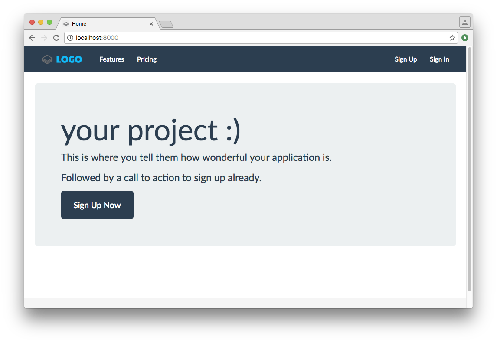

[](https://pyup.io/repos/github/jayfk/cookiecutter-saas/)
[](https://travis-ci.org/jayfk/cookiecutter-saas) 
[](https://codecov.io/gh/jayfk/cookiecutter-saas)
[](http://cookiecutter-saas.readthedocs.io/en/latest/?badge=latest)

Cookiecutter SaaS is a highly specialised project template for SaaS websites. It is based on Django with full (optional) React & Redux support.

# Features
*Note: This section is incomplete, see [#47](https://github.com/jayfk/cookiecutter-saas/issues/47)*

- Docker on development and production
- 100% project test coverage
- subscription management out of the box with stripe
- invoicing and VAT collection
- React and Redux integration (optional)
- Private beta mode
- Free subscription support (freemium & trial)
- On production:
    - Error log aggregation and notification
    - Application monitoring
    - Managed newsletter sign ups
    - HTTPs out of the box (Let's encrypt)
    - Zero downtime deployments

*This is only a small subset of available features. [Show all Features](https://cookiecutter-saas.readthedocs.io/en/latest/write_your_app.html)*

# Stack
*Note: This section is incomplete, see [#46](https://github.com/jayfk/cookiecutter-saas/issues/45)*

- Django
- Celery task queue
- React & Redux (optional)
- Redis
- Postgres
- Caddy web server

*Want to know more? Check out the [stack](https://cookiecutter-saas.readthedocs.io/en/latest/stack.html) section in the docs.*

# Installation

First, you need to install Cookiecutter:

    pip install cookiecutter

Now run it against this repo:

	cookiecutter https://github.com/jayfk/cookiecutter-saas
	
Cookiecutter will prompt you for some options on how the project should be generated for you. If you are doing this for the first time, check out the [prompts section](#todo-link-to-prompts) in the docs.

```
project_name [project_name]: Demo
project_slug [demo]:
author_name [Jannis Gebauer]:
email [ja.geb@me.com]:
info_mail [ja.geb@me.com]:
domain_name [example.com]: demo.cookiecutter-saas.com
timezone [UTC]:
Select django_long_term_support:
1 - yes
2 - no
Choose from 1, 2 [1]: 2
Select react:
1 - yes
2 - no
Choose from 1, 2 [1]: 1
Select blog:
1 - yes
2 - no
Choose from 1, 2 [1]: 1
Select private_beta:
1 - yes
2 - no
Choose from 1, 2 [1]: 1
Select free_subscription_type:
1 - freemium
2 - trial
3 - None
Choose from 1, 2, 3 [1]: 1
```

Once Cookiecutter finishes, enter the project directory and take a look around:

    cd demo/
    ls -la
    
# Developing locally

## Prereqiuisites
Cookiecutter SaaS uses Docker for development and production, make sure Docker and Docker Compose are installed. If you are planning to push your project to production (you should), you'll also need to install Docker Machine.

### On macOS
Follow the [Docker for Mac](https://docs.docker.com/docker-for-mac/) installation instructions. This will install Docker, Docker Compose and Docker Machine on your Mac.

### Windows
Follow the [Docker for Windows](https://docs.docker.com/docker-for-windows/) installation instructions. This will install Docker, Docker Compose and Docker Machine on your Windows machine.

### Linux
First, you need to install the Docker engine, follow the [Docker on Linux](https://docs.docker.com/engine/installation/#/on-linux) installation instructions. Next, you need to [install Docker Compose](https://docs.docker.com/compose/install/) and [install Docker Machine](https://docs.docker.com/machine/install-machine/).

Make sure everything is installed correctly by running:

	docker --version
	docker-compose --version
	docker-machine --version
		
## Running the Project

Before running the project for the first time, you need to build it.

Start the build process with: 

    docker-compose -f dev.yml build

This tells Docker Compose to:

- pull all required base images from Docker Hub
- install all python dependencies via pip (and npm if you are going to using react)
- copy utility scripts into the image
- set up all required environment variables    

This is going to take a while the first time you run it. Subsequent builds will be a lot faster because Docker caches each build step.

While you wait, check out the [Third Party Services](https://cookiecutter-saas.readthedocs.io/en/latest/third_party_services.html) section. During development - in order to test subscriptions - we just need the Stripe and Octobat keys to be set. Create an account for both services and copy the keys to `config/settings/local.py`.

Once the build process is completed, run the project with:

	docker-compose -f dev.yml up
	
You should see a lot of log messages flying by as each container is initializing itself. Look at the logs.

	django_1    | Django version 1.10, using settings 'config.settings.local'
	django_1    | Development server is running at http://0.0.0.0:8000/
	django_1    | Using the Werkzeug debugger (http://werkzeug.pocoo.org/)
	django_1    | Quit the server with CONTROL-C.
	django_1    |  * Debugger is active!
	django_1    |  * Debugger pin code: 241-491-852
	
As soon as you see a log similar to this, your project is ready. 
 
Fire up your browser and go to [http://localhost:8000](http://localhost:8000).


If you want, you can now create a super user. Open up a second terminal and run:

	docker-compose -f dev.yml python manage.py createsuperuser

## What's next?

*Note: Some parts of the documentation are still incomplete. The % next to each link indicates how far the documentation for the topic is.* 

- [Write your app](https://cookiecutter-saas.readthedocs.io/en/latest/write_your_app.html) *40%*
- [Things to change](https://cookiecutter-saas.readthedocs.io/en/latest/things_to_change.html) *50%*
- **Project Specific**:
    - [Preinstalled apps](https://cookiecutter-saas.readthedocs.io/en/latest/cookiecutter_saas_preinstalled_apps.html) *70%*
    - [Settings](https://cookiecutter-saas.readthedocs.io/en/latest/cookiecutter_saas_settings.html) *60%*
- [Subscriptions](https://cookiecutter-saas.readthedocs.io/en/latest/subscriptions.html) *0%*
- [Project code overview](https://cookiecutter-saas.readthedocs.io/en/latest/code_overview.html) *0%*
- [Third Party Services](https://cookiecutter-saas.readthedocs.io/en/latest/third_party_services.html) *80%*
- [React](https://cookiecutter-saas.readthedocs.io/en/latest/react.html) *0%*
- **Production**:
    - [Get the Production Addon](https://gumroad.com/l/CgvLn)
    - [Deploying to production](https://cookiecutter-saas.readthedocs.io/en/latest/production.html) *20%*
    - [Scaling](https://cookiecutter-saas.readthedocs.io/en/latest/scaling.html) *0%*
- [Dependencies](https://cookiecutter-saas.readthedocs.io/en/latest/dependencies.html) *95%*
