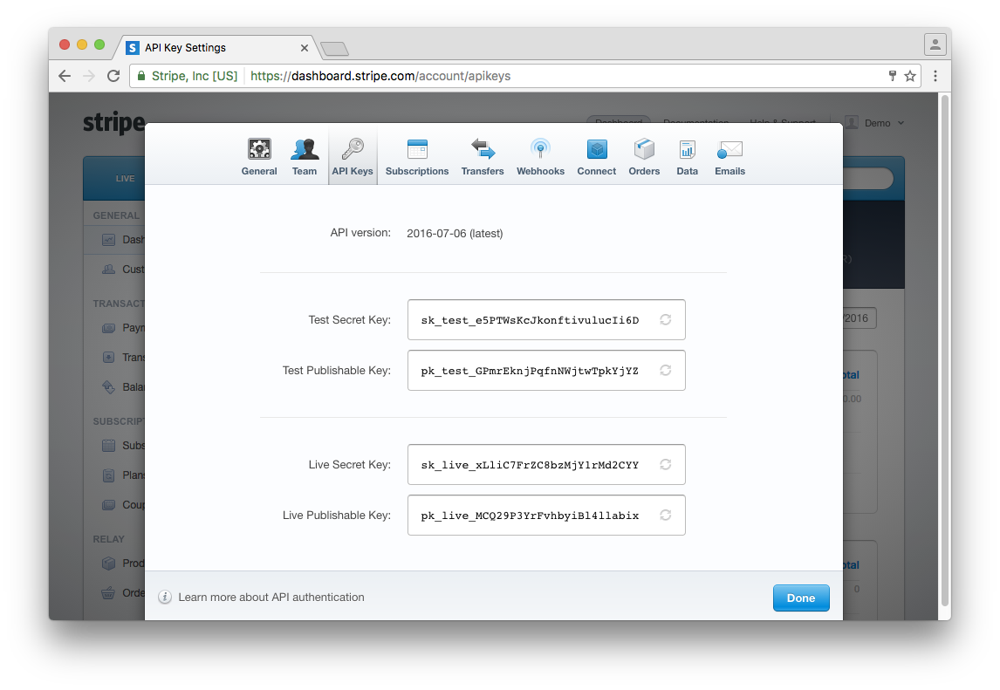
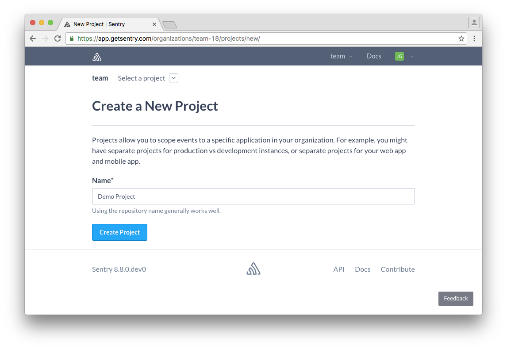
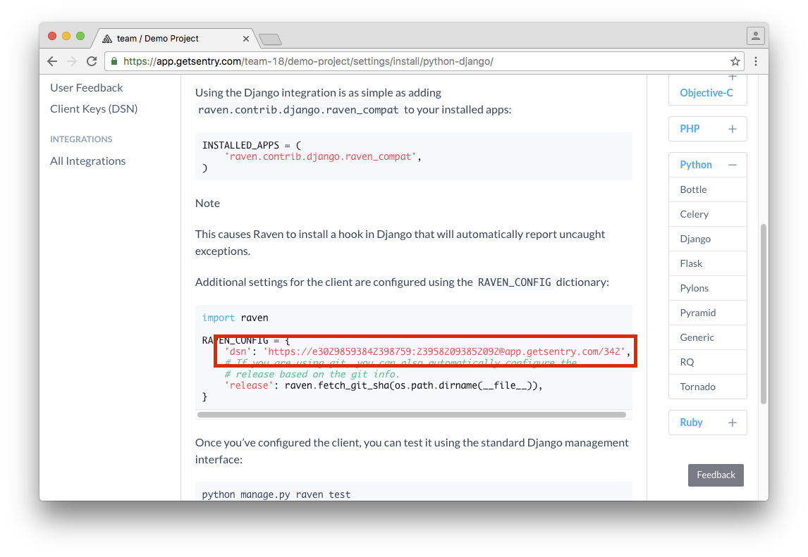
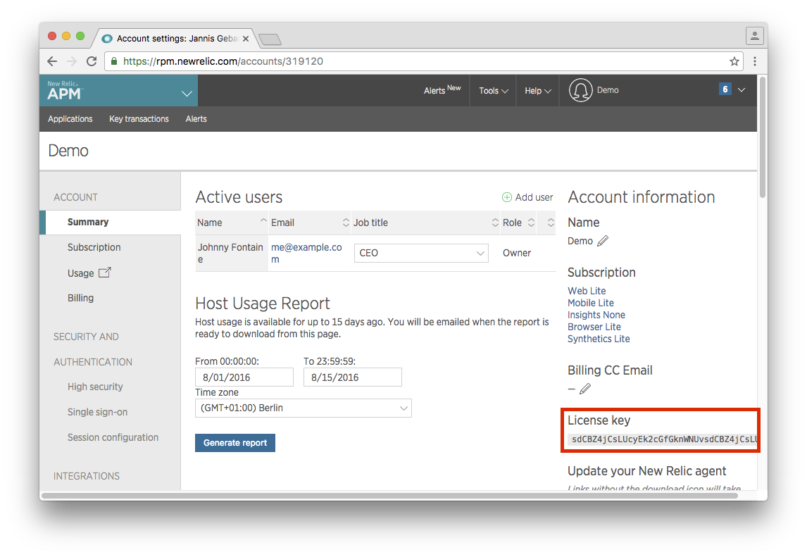
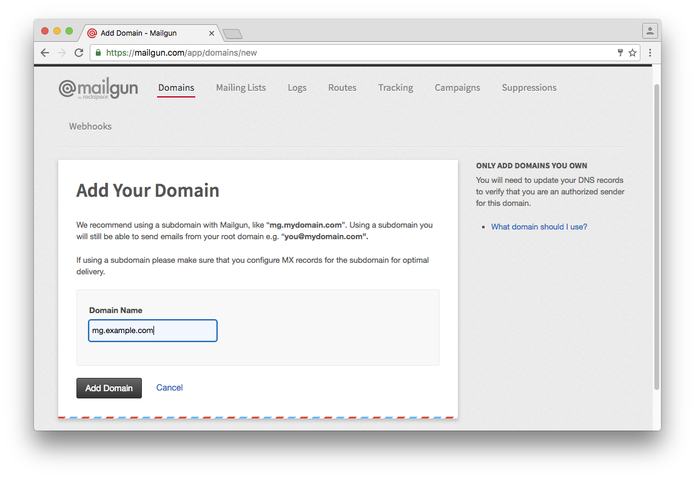
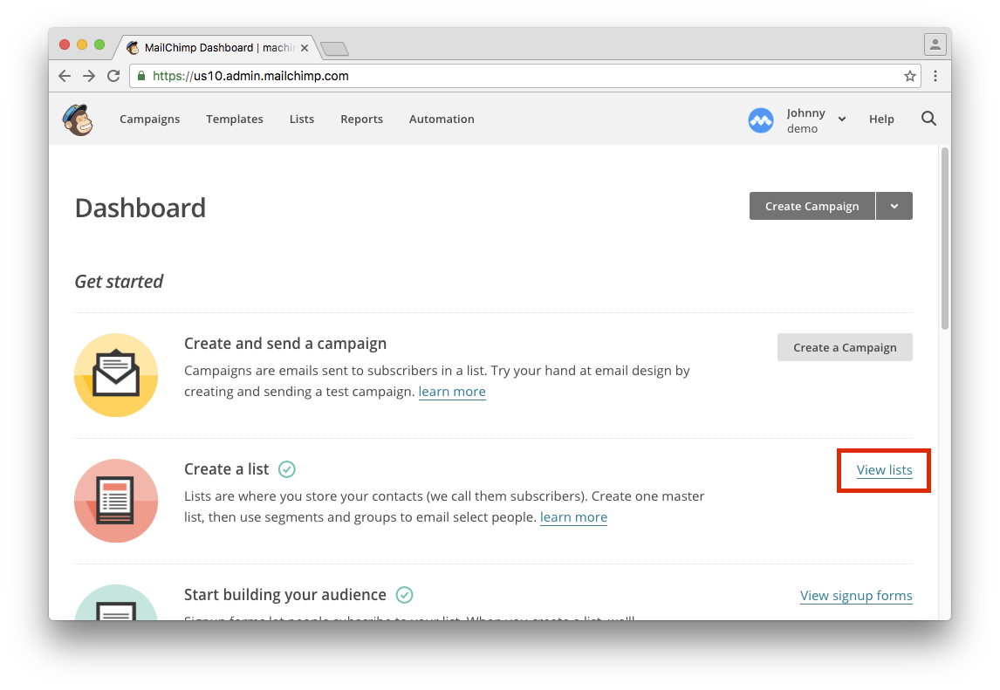
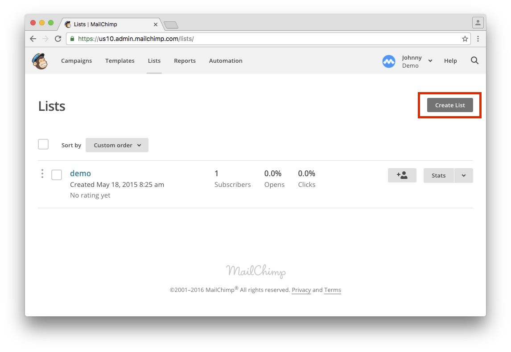
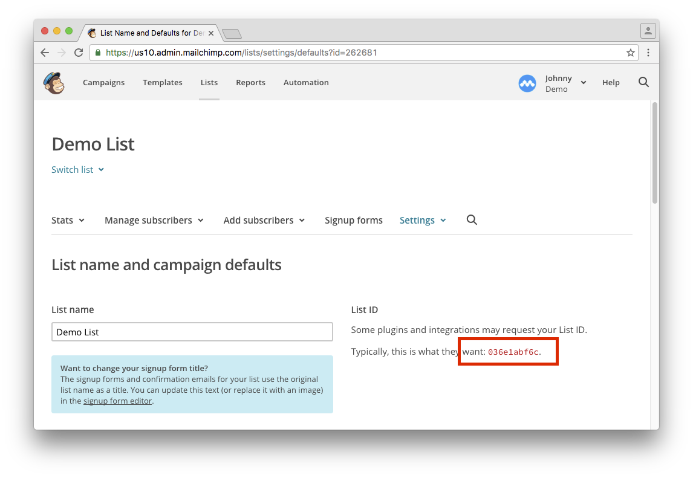
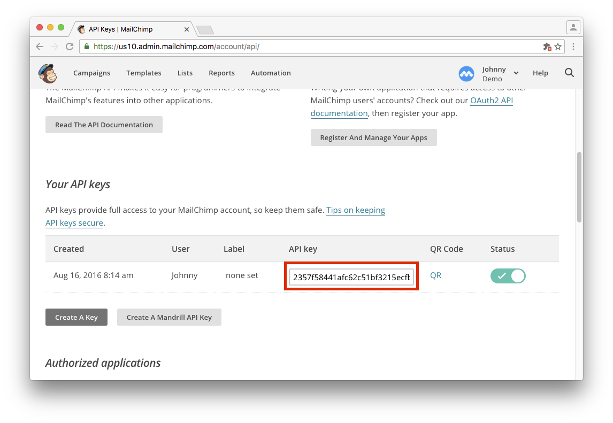

# Third Party Services
## Stripe
Todo

Used in: `development`, `production`

1. Go to [stripe.com](https://stripe.com/) and create a new account, or log in to an existing one.
2. Click on your profile picture in the upper right corner and then on `account settings`
3. Select the `API Keys` tab and copy the test and live keys.  
4. Test keys for `development` are going into `config/settings/local.py`:
	- Test Secret Key goes into `PINAX_STRIPE_SECRET_KEY`
	- Test Publishable Key goes into `PINAX_STRIPE_PUBLIC_KEY`
5. Live keys for `production` are going into `.env`. *If you are in beta, you can use your test keys here too.*
	- Live Secret Key goes into `PINAX_STRIPE_SECRET_KEY`
	- Live Publishable Key goes into `PINAX_STRIPE_PUBLIC_KEY`

## Octobat
Todo

Used in: `development`, `production`

1. Go to [www.octobat.com](https://www.octobat.com/) and create a new account, or log in to an existing one.
2. Click on the chevron in the upper left corner and then on `API Keys & Webhooks`
3. Select the `API Keys` tab and copy the test and live keys.  
4. Test keys for `development` are going into `config/settings/local.py`:
	- Current Test API Secret Key goes into `OCTOBAT_PRIVATE_KEY`
	- Current Live API Publishable Key goes into `OCTOBAT_PUBLIC_KEY`
5. Live keys for `production` are going into `.env`. *If you are in beta, you can use your test keys here too.*
	- Current Live API Secret Key goes into `OCTOBAT_PUBLIC_KEY `
	- Current Live API Publishable Key goes into `OCTOBAT_PRIVATE_KEY`

## Sentry
Todo

Used in: `production`

1. Go to [getsentry.com](https://getsentry.com/) and create a new account, or log in to an existing one.
2. Click on the `New Project` button and fill in a name. 
3. On the "Configure your application" screen click on `Django`.
4. Scroll down until you see the declaration of the `RAVEN_CONFIG` dictionary. 
5. Copy the `dsn` into the `.env` file at `DJANGO_SENTRY_DSN`.

## New Relic
Todo

Used in: `production`

1. Go to [newrelic.com](https://newrelic.com/) and create a new account, or log in to an existing one.
2. Click on your profile in the upper right corner and then on `Account Settings`.
3. Your license key is on the right side. 
4. Copy the license key into the `.env` file at `NEW_RELIC_LICENSE_KEY`.

## Mailgun
Todo

Used in: `production`

1. Go to [mailgun.com](https://mailgun.com/) and create a new account, or log in to an existing one.
2. Click on the `Add New Domain` button to create a new domain. 
3. Follow the steps on the next page to set up your DNS records.
4. Scroll down and click on the `Continue To Domain Overview` button.
5. Locate your API key under domain information. 
4. Copy the API key into the `.env` file at `DJANGO_MAILGUN_API_KEY`.

## Mailchimp
Todo

Used in: `production`

1. Go to [mailchimp.com/](https://mailchimp.com//) and create a new account, or log in to an existing one.
2. On your dashboard, click on `View lists`. 
3. Click on `Create List` to create a new list for your site. 
4. Fill in the details and click on `Save` at the bottom of the form.
5. Click on `Settings` > `List name and defaults`. The list ID is on the right side. 
4. Copy the list ID into the `.env` file at `MAILCHIMP_LIST`.
5. Next, click on your profile menu in the upper right and then on `Profile`.
6. Click on the `Extras` tab and then on `API keys`.
7. If you haven't already, click on `Create A Key`. 
8. Copy the API key into the `.env` file at `MAILCHIMP_API_KEY`.
